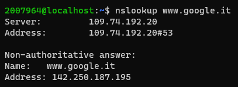

## `connect()`

La chiamata di sistema `connect()` inizializza una connessione ad un socket. La sua sintassi è la seguente

```c
#include <sys/types.h>
#include <sys/socket.h>

int connect(int sockfd, const struct sockaddr *addr, socklen_t addrlen);
```

La chiamata di sistema `connect()` connette il socket a cui fa riferimento il descrittore di file *file descriptor* `sockfd` all' indirizzo specificato da `addr`.

L'argomento `addrlen` specifica la dimensione di `addr`. Il formato dell'indirizzo in `addr` è determinato dallo spazio degli indirizzi del socket `sockfd`

<div style="column-count: 2">
    <div>
        Se il socket <code>sockfd</code> è del tipo <code>SOCK_DGRAM</code>, allora <code>addr</code> è l'indirizzo a cui vengono inviati i datagrammi per impostazione predefinita e l'unico indirizzo da cui vengono ricevuti i datagrammi.
    </div>
    <div>
        Se il socket è di tipo <code>SOCK_STREAM</code> o <code>SOCK_SEQPACKET</code>, questa chiamata tenta di stabilire una connessione al socket associato all'indirizzo specificato da <code>addr</code>.
    </div>
</div>

Generalmente i socket di protocollo basati sulla connessione possono connettersi `connect()` solo una volta. I socket di protocollo senza connessione possono utilizzare `connect()` più volte per modificare la loro associazione.

I socket senza connessione possono dissolvere l'associazione collegandosi a un indirizzo con il membro `sa_family` di `sockaddr` impostato su `AF_UNSPEC`

#### Valore di ritorno

Le la connessione o l'associazione ha esito positivo, viene restituito 0. Altrimenti, in caso di errore, viene restituito -1 e `errno` viene impostato in modo appropriato.

# Schema di implementazione della connect

```c
int connect ( s, struct sockaddr * a, int len){ 
  if ( a->sa_family == AF_INET){
    struct sockaddr_in *x = (struct sockaddr_in *) a; 
    x->sin_port …. 
    x->sin_addr….
  } 
  else if ( a->sa_family == AF_X25){ 
    struct sockaddr_x25 *x = (struct sockaddr_x25 *) a;
  } 
} 
```

Struttura della chiamata di connect:

```c
struct sockaddr_in addr; 
addr.sin_family = AF_INET; 
Addr.sin_port = htons(80); 
Addr.sin_addr.saddr = <indirizzo ip del server> 
connect(s,(struct sockaddr *)&addr, sizeof(struct sockaddr_in))
```

# Esempio di connessione

PRIMA PARTE: CREAZIONE DEL SOCKET

```c
#include <sys/types.h>
#include <sys/socket.h>
#include <stdio.h>
#include <errno.h>
#include <arpa/inet.h>
#include <unistd.h>

struct sockaddr_in remote_addr;
unsigned char * ip;

int main(){
  int s,t;

  // Viene effettuata la chiamata a sistema per creare il socket
  s = socket(AF_INET, SOCK_STREAM, 0);

  /* Questo if verifica se il socket è stato creato correttamente. Infatti se il numero
     intero di ritorno vale -1 allora la connessione al socket fallisce 
  */
  if (-1 == s){
    perror("Socket fallita"); // Manda un messaggio di errore
    printf("%d\n",errno);
    return 1; // Termina il programma in errore
  }
```

SECONDA PARTE: CREAZIONE DEL COLLEGAMENTO `connect()`

```c
  remote_addr.sin_family = AF_INET; // Tipo di collegamento (Protocollo internet IPv4)
  remote_addr.sin_port = htons(80); // Porta di rete 80 

  ip = (unsigned char*)&remote_addr.sin_addr.s_addr; 

  // Per questo esempio prendiamo l'indirizzo di www.google.com (vedi sotto come)
  ip[0]=142; ip[1]=250;ip[2]=200;ip[3]=36;

  // Istanzia il collegamento con connect()
  t = connect(s,(struct sockaddr *) &remote_addr,sizeof(struct sockaddr_in));
  
  /*t è una variabile intera che ci dice se il collegamento è andato a buon fine, 
se t = 0 allora non vi sono stati problemi, altrimenti se vale -1 vi è un errore. 
E' necessario verificare sia subito se ci sono stati errori ma anche dopo un 
lasso di tempo per vedere se la connessione con il socket ha "retto".*/ 
  
  if(t ==-1){  // Verifica se il collegamento è ancora valido
    perror("Connect Fallita\n"); // Manda un messaggio di errore
    return 1; // Termina il programma con codice di uscita 1 (errore)
  }
  else if(t==0){
    printf("TUTTO OK");
  }
  
  sleep(5);  // Aspetta per 100 secondi
  
  if(t ==-1){  // Verifica se il collegamento è ancora valido
    perror("Connect Fallita\n"); // Manda un messaggio di errore
    return 1; // Termina il programma con codice di uscita 1 (errore)
  }
  
  return 0; // Termina il programma senza errori
}
```

Struttura di `struct sockaddr_in`

```c
struct sockaddr_in {
  sa_family_t    sin_family; /* address family: AF_INET */
  in_port_t      sin_port;   /* port in network byte order */
  struct in_addr sin_addr;   /* internet address */
};
```

Struttura dell' internet address `struct in_addr`  e  `sin_addr`

```c
struct in_addr {
  uint32_t  s_addr;     /* address in network byte order */
};
```

Per vedere l'indirizzo ip di un sito usare il comando linux

```
nslookup <indirizzo web sito>
```

Ad esempio con il comando `nslookup www.google.it` otteniamo

 

Da cui ricaviamo l'indirizzo IP di Google: 142.250.187.195

# Lettura da connessione

Proviamo ora a leggere dal collegamento che abbiamo fatto

```c
char * request = "GET / \r\n";
char request2[100];
unsigned char response[1000001];
  
for(t=0;request[t];t++);
write(s,request,t);
//sleep(2);
while(t=read(s,response,1000000)){
  for(int i=0; i<t;i++) printf("%c",response[i]);
}
```

Notiamo che lo stream è pressochè infinito... in quanto google ci sta mandando la sua pagina ma noi non la stiamo usando
