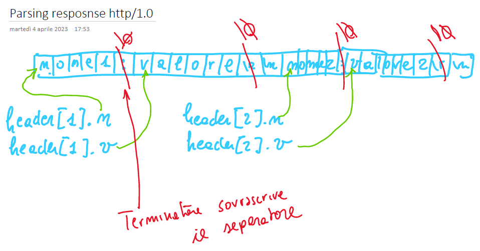

Riceviamo dei caratteri dallo stream quando sono disponibili. Dobbiamo fin da subito cercare di interpretaare questi caratteri che arrivano. Dobbiamo dividere gli elementi in sottostringhe, le stringhe sono delimitate dai terminatori

