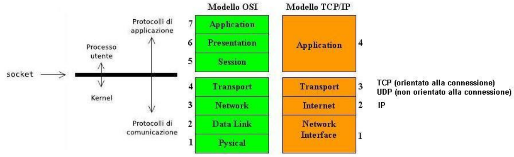

## Client web: `socket`/`connect`

Il modello ISO/OSI ha reso necessario definire e diffondere l'uso di strumenti standard di comunicazione

Per la comunicazione remota, il sistema Unix BSD utilizza l'interfaccia dei `socket` come *endpoint* per comunicare in modo flessibile, differenziato ed efficiente

L'interfaccia dei socket fornisce un'astrazione dei meccanismi di base per implementaree programmi client/server. Un socket è un'estremità di comunicazione tra processi. Non sono altro che un interfaccia fra i livelli superiori e quelli inferiori del modello OSI o TCP/IP, essi ci permettono di scrivere dei programmi senza doverci preoccupare di ciò che avviene nei livelli più bassi della pila e in particaolre al livello di trasposto (TCP,UDP) e rete (IP) che saranno per noi trasparenti



Il socket è il punto di ingresso/uscita di un flusso dati.

## Linux Programmer's Manual

`man 2 socket` richiama l' insieme di funzioni che fanno interagire le applicazioni con il sistema operativo.

Un `socket()` crea un endpoint per la comunicazione e ritorna un **descrittore**. La sua sintassi è la seguente

```c
#include <sys/types.h>
#include <sys/socket.h>

int socket(int domain, int type, int protocol);
```

Come prima cosa notiamo che è necessario caricare prima dell' utilizzo dei socket delle librerie, che si trovano nelle cartelle di sistema `sys`, queste librerie inseriscono del testo all' interno del preprocessing dei file prima della compilazione. In particolare includiamo la libreria `types.h` e `socket.h` 

Abbiamo detto che `socket()` ritorna un **descrittore**, sotto forma di un numero intero `int`. Il descrittore, anche detto *file descriptor* non è altro che l'indice di una tabella. 

```c
int socket(int domain, int type, int protocol);
```

Osservando l'interfaccia di questa funzione notiamo che essa è sufficientemente generale, infatti essa deve essere mantenuta nel tempo e quindi deve essere in grado di adattarsi ai protocolli futuri, definendo sempre un protocollo univoco.

Andiamo ora ad analizzare nel dettaglio gli argomenti della chiamata `socket()`, essa richiede tre parametri che vanno a definire la tassonomia dei servizi.

**`SOCKET()`** è un system call che restituisce un file descriptor ovvero un indice di una tabella.

### Domain

The domain argument specifies a communication domain; this selects the protocol family which will be used for communication.

These families are defined in `<sys/socket.h>`. The [sys/socket.h](https://pubs.opengroup.org/onlinepubs/7908799/xns/syssocket.h.html) header defines at least the following values for the **domain** argument:

* `AF_UNIX,AF_LOCAL`  used in local communication, file system pathnames
* `AF_INET` protocollo internet IPv4
* `AF_INET6` protocollo internet IPv6
* ...

The **domain** argument specifies the address family used in the communications domain. The address families supported by the system are implementation-dependent.

### Type

The socket has the indicated type, which specifies the communication semantics. The *type* argument specifies the socket type, which determines the semantics of communication over the socket. The socket types supported by the system are implementation-dependent. Possible socket types include:

* `SOCK_STREAM` provides sequenced, reliable, bidirectional, connection-mode byte streams, and may provide a transmission mechanism for out-of-band data.
* `SOCK_DGRAM` provides datagrams, which are connectionless-mode, unreliable messages of fixed maximum length.
* `SOCK_SEQPACKET`: Provides sequenced, reliable, bidirectional, connection-mode transmission path for records. A record can be sent using one or more output operations and received using one or more input operations, but a single operation never transfers part of more than one record. Record boundaries are visible to the receiver via the MSG_EOR flag. 

Some socket types may not be implemented by all protocol families.

Quando richiedo un servizio di rete io posso accedervi con due modalità: STREAM e DATAGRAM

* Nel caso dello STREAM chiedo alla rete un servizio analogo alla scrittura o alla lettura di un file, il file è uno stream. Apro lo stream, una serie di lettura/scrittura e dopo una chiusura dello stream. La chiusura dello stream mi da garanzia dell'avvenuta scrittura del file.

  * Il TCP si occupa del `SOCK_STREAM` quindi della gestione della connessione in modalità STREAM. Quindi si occupa di aprire e chiudere il canale.
* Il modello a DATAGRAM è un blocco di dati che viene mantenuto integro.

  * L'UDP si occupa di veicolare i pacchetti della rete, i messaggi `SOCK_DGRAM`

Le applicazioni si possono basare su uno stream oppure su messaggi.

### Protocol argument

If the *protocol* argument is non-zero, it must specify a protocol that is supported by the address family. The protocols supported by the system are implementation-dependent.

## socket() example

Nell' esempio che riportiamo, creiamo ora tre socket del tipo definito dal protocollo IPv4 e usando la connessione in modalità STREAM

```c
#include <sys/types.h>
#include <sys/socket.h>
#include <stdio.h>

int main(){
   int s;
   s = socket(AF_INET, SOCK_STREAM,0);
   printf("%d\n",s);
   s = socket(AF_INET, SOCK_STREAM,0);
   printf("%d\n",s);
   s = socket(AF_INET, SOCK_STREAM,0);
   printf("%d\n",s);
}
```

Il risultato dei vari `printf` è 3 4 5 in quanto il numero di socket inizia da 3 in quanto i primi sono già occupati in fase di avvio dal programma, gestiscono l'IO e la gestione degli errori. Il socket è unicamente visibile all'interno del processo, ogni programma istanza i socket che iniziano sempre da 0.
